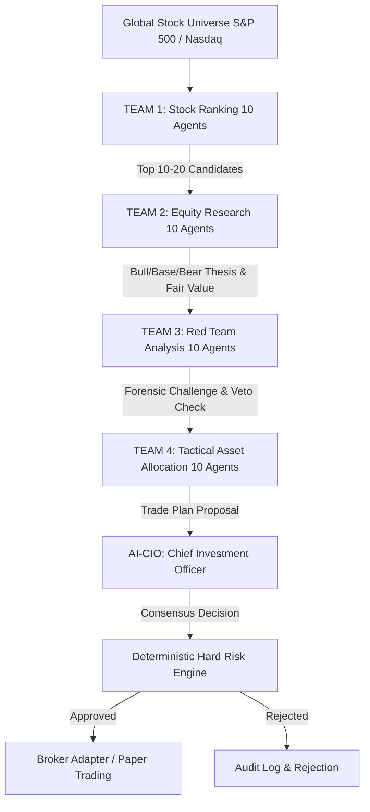

# System Architecture: Global Equity Intelligence & Autonomous Trading System

## 1. Executive Overview
The **Global Equity Intelligence & Autonomous Trading System** is an institutional-grade, multi-agent AI investment platform designed to analyze global stocks (S&P 500, Nasdaq 100, Global Large Caps) through a structured **Investment Committee** methodology.

## 2. Multi-Agent Hierarchy
The system deploys **41 specialized AI Agents** organized into 4 functional teams and a Supreme Council:
- **Team 1: Stock Ranking (T1-01 to T1-10)**: Fast factor-based screening (Quality 18%, Growth 15%, Momentum 15%, Earnings Revision 12%, Valuation 10%, Technical Setup 12%, Catalyst 8%, Liquidity 5%, Market Context 5%).
- **Team 2: Equity Research (T2-01 to T2-10)**: In-depth financial analysis (P&L, Balance Sheet, Free Cash Flow, Moat, Management, DCF Fair Value).
- **Team 3: Red Team Analysis (T3-01 to T3-10)**: Adversarial stress testing (Forensic accounting, Beneish M-Score, Crowded trade, `RED_TEAM_VETO`).
- **Team 4: Tactical Asset Allocation (T4-01 to T4-10)**: Order engineering (Entry Zone, Invalidation, ATR Stop Loss, TP1-3, Fractional Kelly Sizing).
- **AI-CIO (Chief Investment Officer)**: Final synthesis, voting consensus, and structured rationale.

## 3. Deterministic Hard Risk Engine
To prevent catastrophic AI hallucinations, **no LLM has authority to send orders directly to brokers or bypass risk limits**.
- **Max Single Position Size**: 10%
- **Max Portfolio Exposure**: 90% (Min 10% Cash)
- **Max Sector Concentration**: 25%
- **Max Drawdown Circuit Breaker**: 12%
- **Max Daily Loss Breaker**: $5,000
- **Minimum Risk/Reward**: 2.0:1
- **Global Kill Switch**: Immediate cessation of all order flows.
