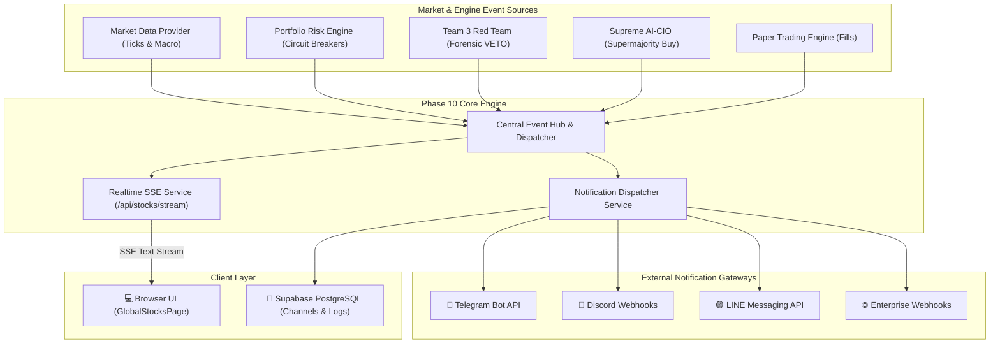

# 📋 PRE-IMPLEMENTATION PLAN: PHASE 10 — REAL-TIME SSE STREAMING & MULTI-CHANNEL NOTIFICATION ENGINE

**Document Reference:** `docs/PHASE10_PRE_PLAN.md`  
**Standard:** Rule 39 Conformance (Pre-Implementation Plan & Formal Architecture Review)  
**System:** Global Equity Intelligence & Autonomous Trading System  
**Phase:** Phase 10 — Real-Time Server-Sent Events (SSE) Streaming & Multi-Channel Alert Engine  
**Author:** Principal Software Architect + Head Quantitative Developer + DevOps Engineer  
**Timestamp:** 2026-10-08T09:30:00+07:00  
**Status:** **PLANNING COMPLETE — READY FOR EXECUTION**  

---

## 1. Executive Summary & Objectives

Following the successful deployment and verification of:
- **Phases 0–8**: 41-Agent Investment Committee, 2-Stage DCF, Forensic Red Team Veto, Half-Kelly Tactical Sizing, Supreme AI-CIO supermajority consensus, 3-Tier Circuit Breakers, Paper Trading & Backtesting.
- **Phase 9**: Real-time market data ingestion via Yahoo Finance, live macro telemetry (VIX, 10Y/2Y Yield, DXY), market hours calculation, Supabase migrations, and production containerization.

**Phase 10: Real-Time SSE Streaming & Multi-Channel Notification Engine** elevates the platform from on-demand request-response to **zero-latency real-time broadcasting and active push intelligence**.

### Core Objectives:
1. **Server-Sent Events (SSE) Streaming Pipeline (`realtime_sse.service.ts`)**:
   - Establish unidirectional real-time event broadcasting over HTTP/HTTPS (`/api/stocks/stream`) without WebSocket handshake complexity or firewall blocks.
   - Multiplex events: Live Price Ticks (`quote_update`), Macro Telemetry (`macro_update`), AI Signals (`ai_signal`), Circuit Breakers (`circuit_breaker`), and Red Team Vetoes (`red_team_veto`).
   - Resilient connection lifecycle: Automatic client registration, heartbeat ping keep-alive (every 15s), exponential reconnection support, and clean teardown on client disconnect.

2. **Multi-Channel Notification Dispatcher (`notification_dispatcher.service.ts`)**:
   - Universal notification adapter supporting:
     - **Telegram Bot API**: High-priority alert messages with markdown formatting and actionable links.
     - **Discord Webhook**: Rich embed cards with color-coded severity (Green = Strong Buy, Amber = Caution, Red = Circuit Breaker/VETO).
     - **LINE Messaging / LINE Notify API**: Clean mobile notifications.
     - **Generic Webhook**: Enterprise JSON payload for custom integrations.
   - Deterministic event routing based on severity:
     - `CRITICAL`: Circuit Breaker Level 1/2/3, Global Kill Switch, Red Team VETO.
     - `HIGH`: Supreme AI-CIO Supermajority Buy ($\ge 67\%$), Macro Volatility Shock (VIX $> 25.0$).
     - `INFO`: Paper Trade Order Filled, Daily Morning Briefing.

3. **Supabase PostgreSQL Persistence & Migration**:
   - Table `notification_channels`: Channel configurations, webhooks, auth tokens, enabled event filters.
   - Table `notification_logs`: Immutable delivery ledger with timestamps, delivery status (`DELIVERED`, `FAILED`, `SIMULATED`), and payload metadata.

4. **Interactive UI & Terminal Control**:
   - **Live SSE Telemetry Header**: Visual live stream connection badge (`🟢 LIVE SSE CONNECTED` / `🟡 RECONNECTING`), auto-updating prices without manual sync.
   - **Notification Control Center**: Tab in `GlobalStocksPage` allowing users to configure channel credentials, test webhooks with 1 click, toggle event subscriptions, and review audit delivery logs.

5. **Comprehensive Verification**:
   - Dedicated unit test suite (`stocks_phase10.test.ts`) covering SSE connection handling, multi-channel dispatch formatting, error resilience, and database logging.
   - Maintain 100% pass rate across all regression suites (700+ total tests).

---

## 2. Architecture & Data Flow



---

## 3. Database Schema Specification

```sql
-- 1. Notification Channels
CREATE TABLE IF NOT EXISTS public.notification_channels (
    id UUID PRIMARY KEY DEFAULT gen_random_uuid(),
    channel_type VARCHAR(30) NOT NULL CHECK (channel_type IN ('telegram', 'discord', 'line', 'webhook')),
    channel_name VARCHAR(100) NOT NULL,
    webhook_url TEXT,
    bot_token TEXT,
    chat_id VARCHAR(100),
    is_active BOOLEAN NOT NULL DEFAULT true,
    subscribed_events TEXT[] NOT NULL DEFAULT ARRAY['CIRCUIT_BREAKER', 'RED_TEAM_VETO', 'CIO_BUY'],
    created_at TIMESTAMPTZ NOT NULL DEFAULT NOW(),
    updated_at TIMESTAMPTZ NOT NULL DEFAULT NOW()
);

-- 2. Notification Audit Logs
CREATE TABLE IF NOT EXISTS public.notification_logs (
    id UUID PRIMARY KEY DEFAULT gen_random_uuid(),
    channel_id UUID REFERENCES public.notification_channels(id) ON DELETE SET NULL,
    channel_type VARCHAR(30) NOT NULL,
    event_type VARCHAR(50) NOT NULL,
    severity VARCHAR(20) NOT NULL CHECK (severity IN ('INFO', 'HIGH', 'CRITICAL')),
    title VARCHAR(255) NOT NULL,
    message TEXT NOT NULL,
    status VARCHAR(20) NOT NULL CHECK (status IN ('DELIVERED', 'FAILED', 'SIMULATED')),
    error_message TEXT,
    sent_at TIMESTAMPTZ NOT NULL DEFAULT NOW()
);

CREATE INDEX IF NOT EXISTS idx_notify_logs_event ON public.notification_logs(event_type);
CREATE INDEX IF NOT EXISTS idx_notify_logs_sent ON public.notification_logs(sent_at DESC);
```

---

## 4. API Specification

| Method | Endpoint | Description |
|---|---|---|
| `GET` | `/api/stocks/stream` | Server-Sent Events stream endpoint for live ticks & notifications |
| `GET` | `/api/stocks/stream/stats` | Active SSE client connections, uptime, and broadcast metrics |
| `GET` | `/api/stocks/notifications/channels` | List all configured notification channels |
| `POST` | `/api/stocks/notifications/channels` | Register or update a notification channel |
| `DELETE` | `/api/stocks/notifications/channels/:id` | Delete a notification channel |
| `POST` | `/api/stocks/notifications/test` | Dispatch a live test notification to a specific channel |
| `GET` | `/api/stocks/notifications/logs` | Fetch recent notification audit delivery logs |

---

## 5. Implementation Roadmap
- **Step 1:** Database Migration (`migrate.ts`) — Add tables `notification_channels` and `notification_logs`.
- **Step 2:** Engine Implementation:
  - `server/src/modules/stocks/realtime/realtime_sse.service.ts`
  - `server/src/modules/stocks/notifications/notification_dispatcher.service.ts`
- **Step 3:** Integration into Existing Engines (`portfolio_risk.engine.ts`, `cio_consensus.engine.ts`, `stocks.routes.ts`).
- **Step 4:** Frontend UI Enhancement (`GlobalStocksPage.tsx` with Live SSE badge and Notification Management Tab).
- **Step 5:** Comprehensive Unit & Regression Tests (`stocks_phase10.test.ts` & `run_all_tests.ts`).
- **Step 6:** Post-Implementation Report (`docs/PHASE10_POST_REPORT.md`) & Sign-off.
