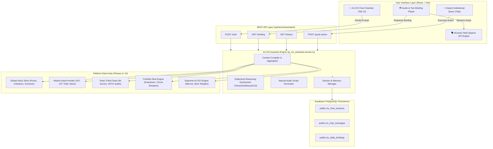

# 📋 PRE-IMPLEMENTATION PLAN: PHASE 11 — INTERACTIVE AI-CIO DIALECTICAL CHAT ASSISTANT & VOICE/TEXT INVESTMENT BRIEFING

**Document Reference:** `docs/PHASE11_PRE_PLAN.md`  
**Standard:** Rule 39 Conformance (Pre-Implementation Plan & Formal Architecture Review)  
**System:** Global Equity Intelligence & Autonomous Trading System  
**Phase:** Phase 11 — Interactive AI-CIO Dialectical Chat Assistant & Executive Voice/Text Briefing  
**Author:** Principal AI Systems Architect + Head Quantitative Developer + Lead Fullstack Engineer  
**Timestamp:** 2026-10-08T10:10:00+07:00  
**Status:** **PLANNING COMPLETE — READY FOR EXECUTION**  

---

## 1. Executive Summary & Problem Statement

Across Phases 0 to 10, the platform successfully constructed a comprehensive, institutional-grade autonomous trading and equity research engine:
- **41 AI Agents across 4 Teams** with calibrated Brier scoring and dynamic committee weighting.
- **2-Stage DCF & Fundamental Research** with Reverse DCF implied growth rates.
- **Forensic Red Team Review** with 8-variable Beneish M-Score and deterministic binding `RED_TEAM_VETO`.
- **Half-Kelly Position Sizing & Multi-Tier ATR Stops** with options overlays and beta hedging.
- **Supreme AI-CIO Consensus Chamber** with Supermajority rules ($\ge 67\%$).
- **Portfolio Drawdown Circuit Breakers (Levels 1–3)** with automated cash de-risking.
- **Virtual Paper Trading & Historical Backtesting Engine** across 4 walk-forward quantitative strategies.
- **Real-Time Data Providers & Macro Telemetry** (Yahoo Finance, live US 10Y Yield, VIX, DXY).
- **Server-Sent Events (SSE) Streaming & Multi-Channel Notifications** (Discord, Telegram, Webhooks).

### The Phase 11 Need:
While the backend possesses vast telemetry (hundreds of data points per ticker across 41 agents and risk engines), fund managers and retail investors need an **interactive, conversational intelligence interface** that does not simply regurgitate data, but acts as a **true Wall Street Chief Investment Officer (CIO)**.

**Phase 11: AI-CIO Dialectical Chat Assistant & Voice/Text Investment Briefing** delivers:
1. **Dialectical Debate Assistant**: Interrogates any ticker or macroeconomic scenario by presenting the **Thesis (Bull)**, **Antithesis (Bear / Forensic Red Team)**, and synthesizing a deterministic **AI-CIO Actionable Verdict**.
2. **Audio & Text Executive Investment Briefing**: Generates institutional morning and intraday investment briefs with natural, fluent speech scripts playable instantly via browser Web Speech API (`speechSynthesis`).
3. **Session & History Persistence**: Multi-session conversational storage in Supabase PostgreSQL with fast in-memory fallbacks.
4. **Pre-packaged Institutional Quick Queries**: Instant one-click diagnostic queries for portfolio drawdown, VETO audits, high-conviction ideas, and macro regime stress tests.

---

## 2. System Architecture & Data Flow

---

## 3. Core Engine Components & Technical Specifications

### 3.1. Context Compiler (`compileExecutiveContext()`)
Aggregates live platform telemetry into a cohesive snapshot:
- **Macro Regime**: Regime name (e.g. `TECH_BULL_VOLATILE`), S&P 500 trend, VIX level, 10Y Treasury yield, 2Y yield, yield curve inversion flag, DXY index.
- **Portfolio Risk & Drawdown**: Current NAV, Drawdown %, active Circuit Breaker status (NORMAL, L1_HALT_BUYS, L2_DELEVERAGING, L3_EMERGENCY_HALT), Cash % allocation, Sector concentration warnings.
- **Consensus & Recommendations**: Recent AI-CIO supermajority approvals ($\ge 67\%$), top rated stocks from Team 1 & 2.
- **Red Team Forensic Radar**: Tickers currently flagged or vetoed by Team 3 (Beneish M-Score $> -1.78$, crowded short interest, accounting red flags).

### 3.2. Dialectical Inquiry Engine (`synthesizeDialecticalResponse()`)
For any query regarding a specific stock (e.g., "NVDA", "TSLA", "AAPL") or general asset class:
1. **Thesis (Bull Case)**:
   - Primary growth vectors, momentum factors, DCF upside potential, catalyst timeline.
2. **Antithesis (Bear Case / Red Team Audit)**:
   - Forensic red flags, valuation stretch, deceleration threats, technical breakdown points, Beneish M-Score assessment.
3. **Synthesis (AI-CIO Final Verdict & Tactical Plan)**:
   - Clear categorical rating (`SUPERMAJORITY_BUY`, `BUY`, `ACCUMULATE`, `HOLD`, `REDUCE`, `VETO_REJECT`).
   - Sizing recommendation using Half-Kelly criterion cap (max 10%).
   - Dynamic stop-loss level ($1.5 \times ATR_{14}$) and target price trajectory (TP1, TP2, TP3).
   - Institutional warning conditions under which position should be liquidated immediately.

### 3.3. Executive Investment Briefing Generator (`generateDailyBriefing()`)
Creates two synchronized artifacts:
1. **Executive Markdown Report**:
   - Structured briefing suitable for institutional reading on desktop/mobile displays.
   - Breakdown: Market Sentiment & Macro Overview, Key Portfolio Metrics, Top Conviction Opportunities, Active Risk & Red Team Alerts, Tactical CIO Guidance.
2. **Natural Spoken Script (`audioScript`)**:
   - Specially formatted text optimized for speech synthesis engines (Web Speech API).
   - Formatted with punctuation pauses, phonetic currency descriptions (e.g., "จุดห้าเปอร์เซ็นต์" or "15.2 เปอร์เซ็นต์"), natural conversational cadence, and distinct segment transitions.

### 3.4. Database Persistence & Schema Additions
In `server/src/modules/stocks/migrations/migrate.ts`:
- **`cio_chat_sessions`**:
  - `id VARCHAR(64) PRIMARY KEY`
  - `title VARCHAR(255) NOT NULL`
  - `created_at TIMESTAMPTZ`, `updated_at TIMESTAMPTZ`
- **`cio_chat_messages`**:
  - `id VARCHAR(64) PRIMARY KEY`
  - `session_id VARCHAR(64) REFERENCES cio_chat_sessions(id) ON DELETE CASCADE`
  - `role VARCHAR(20) NOT NULL` (`user`, `assistant`, `system`)
  - `content TEXT NOT NULL`
  - `metadata JSONB` (includes `thesis`, `antithesis`, `verdict`, `ticker`, `metrics`)
  - `created_at TIMESTAMPTZ`
- **`cio_daily_briefings`**:
  - `id VARCHAR(64) PRIMARY KEY`
  - `briefing_type VARCHAR(30) NOT NULL` (`MORNING`, `INTRADAY`, `EVENING`)
  - `title VARCHAR(255) NOT NULL`
  - `full_text TEXT NOT NULL`
  - `audio_script TEXT NOT NULL`
  - `metrics JSONB NOT NULL`
  - `created_at TIMESTAMPTZ`

---

## 4. REST API Endpoint Specifications

| Method | Endpoint | Description | Status Code |
| :--- | :--- | :--- | :--- |
| `POST` | `/api/stocks/assistant/chat` | Send conversational prompt, receive AI-CIO dialectical reply | 200 OK |
| `GET` | `/api/stocks/assistant/briefing` | Generate or fetch latest Executive Investment Briefing | 200 OK |
| `GET` | `/api/stocks/assistant/history` | List recent conversation sessions or messages by session ID | 200 OK |
| `POST` | `/api/stocks/assistant/history/new` | Initialize new conversation session | 200 OK |
| `DELETE`| `/api/stocks/assistant/history/:id` | Delete conversation session and messages | 200 OK |
| `POST` | `/api/stocks/assistant/quick-action` | Trigger pre-configured diagnostic query | 200 OK |

---

## 5. Frontend UI/UX Specifications (`AICIOChatAssistant.tsx`)

1. **Tab 11: 🤖 ผู้ช่วย AI-CIO (AI-CIO Assistant)**:
   - Added to the main tab navigation in `GlobalStocksPage.tsx`.
2. **Audio Briefing Player Widget**:
   - Card at the top with daily title and audio controls:
     - `▶️ ฟังเสียงบรรยาย (Play)` / `⏸️ หยุดชั่วคราว (Pause)` / `⏹️ รีเซ็ต (Stop)`
     - Playback speed selector: `1.0x`, `1.25x`, `1.5x`
     - Text toggle: View formatted Markdown brief vs spoken script.
3. **Dialectical Chat Feed**:
   - User messages in distinctive right-aligned bubble.
   - AI-CIO messages formatted with structured tabs or expandable badges:
     - 🟢 **Thesis (Bull)**: Green accent border & badge.
     - 🔴 **Antithesis (Bear / Red Team)**: Amber/Red accent border & badge.
     - 🏆 **CIO Verdict & Action Plan**: Institutional Gold/Emerald summary with sizing and stops.
4. **Quick Action Chips**:
   - `📊 วิเคราะห์สุขภาพพอร์ต & Drawdown`
   - `🛑 เช็คหุ้นที่ติด Red Team VETO`
   - `💎 คัด 3 หุ้นเด่น Supermajority Buy`
   - `🌐 วิเคราะห์ Macro, VIX & บอนด์ยีลด์ 10Y`

---

## 6. Testing & Quality Assurance Plan

1. **Dedicated Test Suite (`server/tests/stocks_phase11.test.ts`)**:
   - **Test Suite 1: Context Aggregator**: Verifies correct assembly of macro, portfolio, red team veto, and consensus data.
   - **Test Suite 2: Dialectical Reasoning Engine**: Verifies extraction of ticker, thesis generation, antithesis generation, and CIO verdict calculation.
   - **Test Suite 3: Executive Investment Briefing**: Verifies generation of both Markdown report and Web Speech API natural spoken script.
   - **Test Suite 4: Quick Action Execution**: Verifies correct routing and response structure for all 4 predefined quick actions.
   - **Test Suite 5: Session & Message Persistence**: Verifies session creation, message storage, retrieval, and deletion with fallback resiliency.
   - **Test Suite 6: API Endpoint Route Integration**: Verifies endpoint handlers respond with proper status codes and structured schemas.
2. **Target Test Metrics**:
   - Minimum 35+ dedicated unit tests in Phase 11 suite.
   - Cumulative regression suite (`run_all_tests.ts`): Maintain **100% pass rate** (~760+ total passing tests).
   - Zero TypeScript compile errors (`npm run build`).

---

## 7. Execution Checklist & Milestones

- [ ] **Step 1:** Create `docs/PHASE11_PRE_PLAN.md` (This document).
- [ ] **Step 2:** Update database migrations in `server/src/modules/stocks/migrations/migrate.ts` with Phase 11 tables.
- [ ] **Step 3:** Implement core service `server/src/modules/stocks/assistant/ai_cio_assistant.service.ts`.
- [ ] **Step 4:** Integrate routes in `server/src/modules/stocks/routes/stocks.routes.ts`.
- [ ] **Step 5:** Write unit test suite `server/tests/stocks_phase11.test.ts` and add to `server/tests/run_all_tests.ts`.
- [ ] **Step 6:** Run test suite and achieve 100% pass rate.
- [ ] **Step 7:** Implement frontend component `client/src/components/AICIOChatAssistant.tsx` and integrate into `client/src/pages/GlobalStocksPage.tsx`.
- [ ] **Step 8:** Run frontend build (`npm run build`) and verify clean compilation.
- [ ] **Step 9:** Create `docs/PHASE11_POST_REPORT.md` (Rule 40) and update `docs/ROADMAP.md` & `README.md`.
- [ ] **Step 10:** Git commit and push to GitHub `main`.
