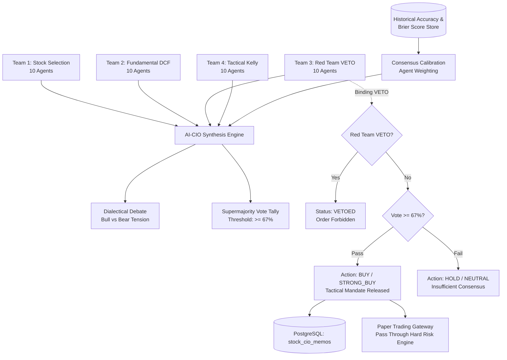

# PHASE 6 PRE-IMPLEMENTATION PLAN
## AI-CIO Investment Committee Chamber & Consensus Calibration Engine

**Project:** Global Equity Intelligence & Autonomous Trading System  
**Phase:** Phase 6 — AI-CIO & Consensus Calibration  
**Date:** 2026-10-06  
**Status:** DRAFT / PENDING EXECUTION  
**Engine Compliance:** Master Prompt Section 3 (AI-CIO), Section 5 (Consensus & Conflict Resolution), Section 6 (Execution Workflow)

---

### 1. Objective & Scope

Phase 6 implements the executive orchestration layer of the system:
1. **AI-CIO (Chief Investment Officer):** The presiding officer who synthesizes multidimensional inputs from all 4 Teams (Team 1 Ranking, Team 2 Fundamental DCF, Team 3 Red Team Forensic/VETO, Team 4 Tactical/Kelly Execution).
2. **Consensus Calibration Engine:**
   - **Supermajority Voting Protocol:** Requiring $\ge 67\%$ approval (28 out of 41 agents) for high-conviction trade execution.
   - **Historical Agent Accuracy Weighting (Brier Score Calibration):**
     $$\text{Brier Score} = \frac{1}{N} \sum_{t=1}^N (f_t - o_t)^2$$
     Agent weight adjusts dynamically: $W_i = \max\left(0.2, 1.0 - \text{Brier}_i\right)$. High-predictive agents gain amplified voting power, while historically inaccurate agents have attenuated voting weight.
   - **Team 2 (Bull Thesis) vs. Team 3 (Bear Thesis) Formal Structured Debate:**
     Synthesizes points and counter-points into explicit dialectical tension (Bull Catalysts vs. Forensic Bear Warnings).
   - **Unanimous Red Team VETO Enforcement:**
     Deterministic override: If Red Team VETO is triggered (Threat Score $\ge 80$ or Red Flags $\ge 3$), the trade is unconditionally **VETOED** regardless of consensus score or LLM enthusiasm.
3. **Final Investment Committee Decision Memo:**
   - Structured JSON + formatted Markdown executive memo.
   - Actionable recommendation: `STRONG_BUY`, `BUY`, `HOLD`, `REDUCE`, `SELL`, or `VETOED`.
   - Allocation and execution mandate linking directly to Team 4 tactical plan.
4. **Database Persistence:**
   - Table `public.stock_cio_memos`: Stores final memos, voting tallies, consensus scores, and dialectical synthesis.
   - Table `public.stock_agent_accuracies`: Stores historical accuracy, Brier scores, prediction logs, and calibration weights for all 41 agents.
5. **REST API Endpoints:**
   - `GET /api/stocks/cio/memo/:ticker`: Retrieve latest CIO Investment Committee Memo for a ticker.
   - `POST /api/stocks/cio/convene`: Convene the full 41-agent committee to debate, vote, calibrate, and output a decision memo.
   - `GET /api/stocks/cio/accuracy`: Retrieve Brier score accuracy leaderboard for all 41 agents.
   - `POST /api/stocks/cio/recalibrate`: Recalibrate agent weights based on historical prediction outcomes.
6. **Frontend UI:**
   - New UI Tab: "AI-CIO Committee Chamber (ห้องประชุมมติการลงทุน 41 Agents)"
   - Interactive Live Committee Voting Visualizer (4 Teams + CIO breakdown).
   - Formal Bull vs. Bear Debate Arena.
   - Dialectical Confidence & Calibration Gauge.
   - Executive CIO Memo Viewer with direct "Execute Committee Mandate" paper trade dispatch.

---

### 2. Architectural Design

---

### 3. Quantitative Voting & Consensus Calibration Formulas

#### 3.1 Agent Weighting via Historical Brier Score
For each agent $i \in \{1, \dots, 41\}$:
$$B_i = \frac{1}{K} \sum_{k=1}^K (P_{i,k} - O_k)^2 \in [0, 1]$$
Where $P_{i,k}$ is predicted probability of positive outcome, and $O_k \in \{0, 1\}$ is actual outcome.
$$\text{Calibrated Weight: } w_i = \max\left(0.20, \frac{1.0 - B_i}{\sum_{j=1}^{41} (1.0 - B_j)} \times 41\right)$$

#### 3.2 Weighted Supermajority Approval Rate
Each agent casts a normalized vote $v_i \in \{0, 1\}$:
$$\text{Raw Approval \%} = \frac{1}{41} \sum_{i=1}^{41} v_i \times 100$$
$$\text{Calibrated Approval \%} = \frac{\sum_{i=1}^{41} w_i \cdot v_i}{\sum_{i=1}^{41} w_i} \times 100$$
$$\text{Supermajority Mandate Met} \iff \text{Calibrated Approval \%} \ge 67.0\% \land \neg \text{RedTeamVeto}$$

#### 3.3 Bayesian Confidence Interval
$$\mu = \text{Calibrated Consensus Score} / 100$$
$$\sigma = \sqrt{\frac{\sum_{i=1}^{41} w_i (v_i - \mu)^2}{\sum_{i=1}^{41} w_i}}$$
$$\text{Confidence Interval (95\%)} = \left[\max(0, \mu - 1.96 \cdot \frac{\sigma}{\sqrt{41}}), \min(1, \mu + 1.96 \cdot \frac{\sigma}{\sqrt{41}})\right]$$

---

### 4. Implementation Steps
1. **Module Engine:** `server/src/modules/stocks/engine/cio_consensus.engine.ts`
   - Complete 41-agent voting simulator with individual agent rationale generators.
   - Brier score accuracy calibration engine.
   - Dialectical debate generator (Team 2 vs Team 3).
   - Executive memo synthesis engine with binding VETO circuit.
2. **Database Migration:** `server/src/modules/stocks/migrations/006_cio_consensus_schema.sql`
   - `stock_cio_memos` and `stock_agent_accuracies`.
   - Register in `migrate.ts`.
3. **REST API Endpoints:** `server/src/modules/stocks/routes/stocks.routes.ts`
   - Mount `/api/stocks/cio/*` routes.
4. **Unit Tests:** `server/tests/stocks_phase6.test.ts`
   - Comprehensive test suite covering supermajority rules, Brier score weighting, dialectical debate generation, VETO overrides, and DB schema.
5. **Frontend UI Integration:**
   - Update `client/src/types/stocks.ts` and `client/src/pages/GlobalStocksPage.tsx`.
   - Add "AI-CIO Committee Chamber" tab with live interactive committee voting, debate cards, and executive memo generator.
6. **Docker Sync & Verification:**
   - Build client, sync to WSL, restart container, run tests, verify endpoints.
